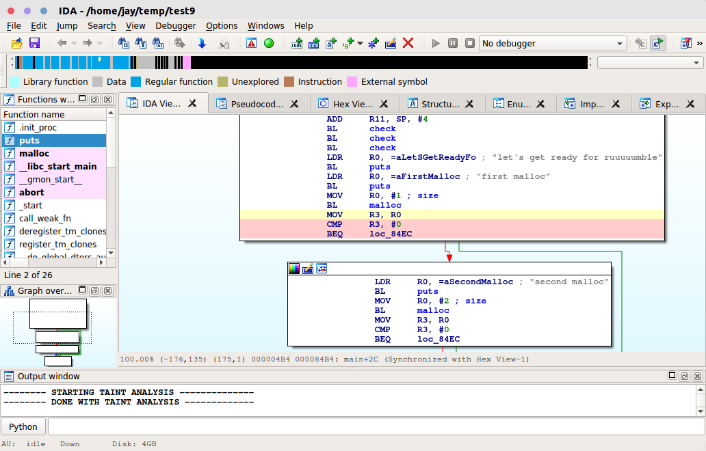
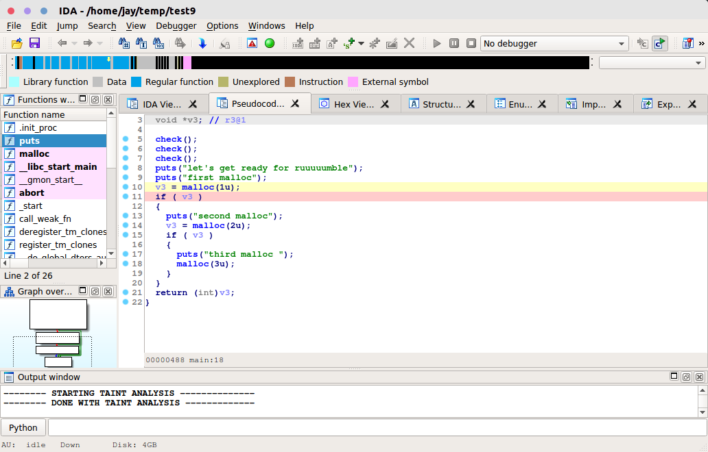
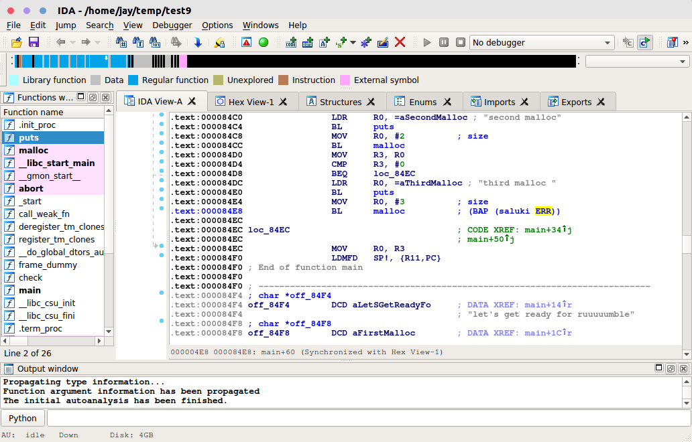
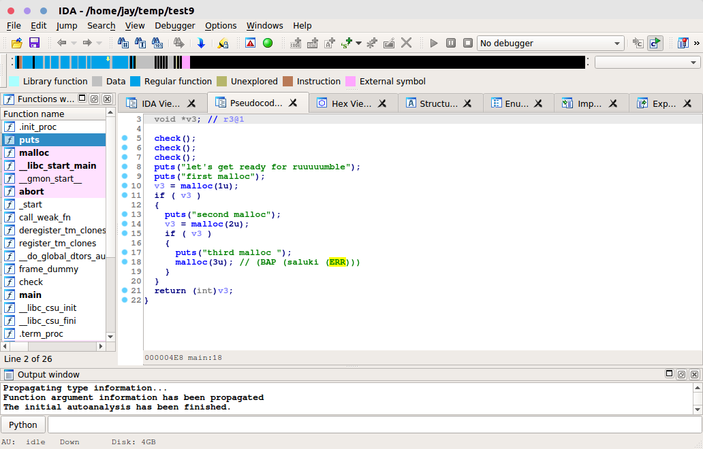
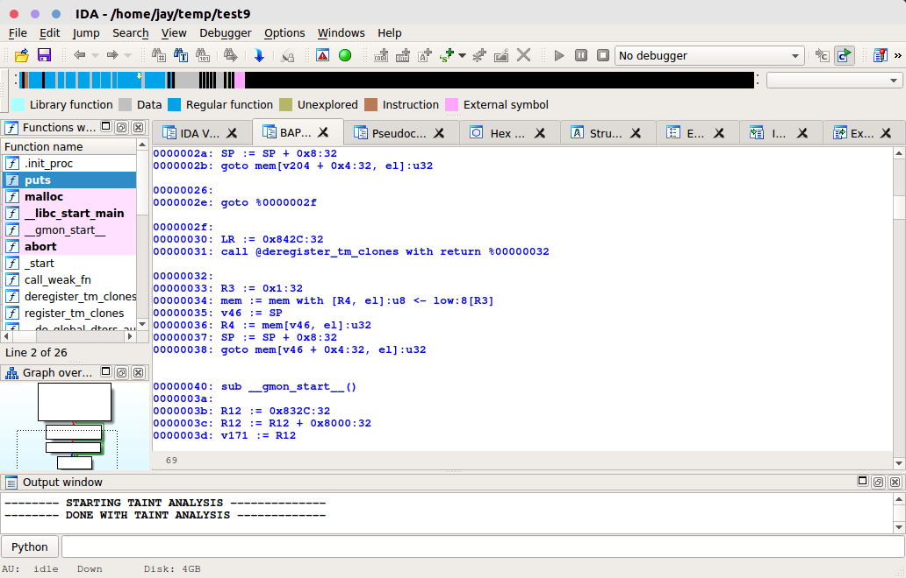

[](https://travis-ci.org/BinaryAnalysisPlatform/bap-ida-python)

BAP IDA Python
==============

This package provides the necessary IDAPython scripts required for
interoperatibility between BAP and IDA Pro. It also provides many
useful feature additions to IDA, by leveraging power from BAP.

Features
--------

BAP-IDA integration package installs several plugins into IDA
distribution. Some plugins works automatically, and do not require
user intervention, while others are invoked with keybindings, or via
the `Edit->Plugins` menu, that can be popped at with the `Ctrl-3`
bindging.


### Function information augmentation

By just hitting the `Shift+P` key, IDA will call BAP which will use
its own analysis (and all the information sources that it knows of) to
obtain all the locations where there are functions. This information
is then propagated to IDA and used to create functions there
automatically. This is especially useful in scenarios where there are
a lot of indirect calls etc and BAP (using its different plugins) is
able to detect functions in the code which IDA is unable to do so.

### Taint Propagation

By choosing a taint source and hitting either `Ctrl+A` (for tainting
an immediate value) or `Ctrl+Shift+A` (for data pointed by a value),
one can easily see how taint propagates through the code, in both
disassembly and decompilation views.

#### In Text/Graph View


#### In Pseudocode View


### BIR Attribute Tagging, with arbitrary BAP plugins

BAP has the ability to tag a lot of possible attributes to
instructions. These BIR attributes can be tagged automatically as
comments in IDA, by running arbitrary plugins in BAP. Just hit
`Ctrl+S`.

Here's an example of output for Saluki showing that a certain malloc
is unchecked (pointing to a potential vulnerability).

Clearing all BAP comments (without affecting your own personal
comments in IDA) can be done by pressing `Ctrl+Shift+S`.

To view all current attributes in the single window hit `Shift-B`.
You can sort attributes by clicking the columns or you can search
through them using IDA's extensive search facilities (hit the `Help`
bottom on the list to get more information). You can jump directly
to the attribute location by selecting it.

#### In Text/Graph View


#### In Pseudocode View


### BAP Task Manager and Viewer

Every instance of BAP will have a corresponding view, that will
accumulate all data written by BAP. The BAP Viewer (`Ctrl-Alt-F5`)
provides an easy way to switch between multiple BAP Views.

Since you can run multiple instances of BAP asynchronously, it is
useful to have an ability to view the state of currently running
processes, and, even, to terminate those who take too much time or
memory.  The BAP Task Manager (accessible via the `Ctrl-Alt-Shift-F5`
keybinding, or via the `Ctrl-3` plugin menu) provides such
functionality.



### Symbol and Type Information

Whenever possible, `bap-ida-python` passes along the latest symbol and
type information from IDA (including changes you might have made
manually), so as to aid better and more accurate analysis in BAP. For
example, let's say you recognize that a function is a malloc in a
stripped binary, by just using IDA's rename feature (Keybinding: `N`),
you can inform BAP of this change during the next run of, say, saluki,
without needing to do anything extra. It works automagically!

Installation
------------

Copy all of the files and directories from the `plugins` directory
into `$IDADIR/plugins`.

The first run of IDA after that will prompt you to provide the path to
BAP (along with a default if IDA is able to automatically detect
BAP). If you wish to edit the path to BAP manually later, you can edit
the file `$IDADIR/cfg/bap.cfg`.

#### Opam?

It is usually much easier to install through opam if you have already
followed all the installation steps in the
[bap repository](https://github.com/BinaryAnalysisPlatform/bap). Just
run:

```
opam install bap-ida-python
```

Debugging
---------

The integration package is still in alpha stage, so there are a few
bugs lurking in the codebase. If you have any issues, then, please,
enable the debug mode, by typing the following command in the IDA's
python console:

```python
BapIda.DEBUG=True
```

This will increase the verbosity level, so that you can see what commands
were actually issued to the bap backend. In the debug mode, the temporary
files will not be removed, so they can be archived and sent to us, for the
ease of debugging.


#### IDA Demo?

You can also use parts of the functionality (i.e. most of everything
except for the decompiler outputs, and batch processing from bap) with
IDA Free/Demo. However, you would need to install IDAPython. See
[here](docs/IDAPython_on_IDADemo.md) for what one of our users
reported to work.
